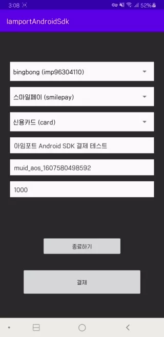
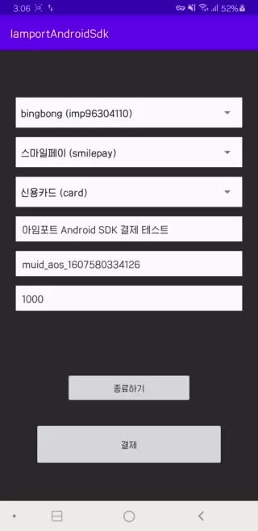

# :seedling: I'mport Android SDK :seedling:

[](https://jitpack.io/#iamport/iamport-android)

## :open_book: 설명

안드로이드 네이티브 앱에서 결제 개발을 간편하게 도와주는 아임포트 SDK 입니다.

- PG 들은 WebView 기반으로 연동되어 있습니다.

- 추후 순차적으로 타 간편결제들도 네이티브 연동 예정입니다.

--- 

- [아임포트][1]

- [아임포트 블로그][2]

- [아임포트 docs][3]

[1]: https://www.iamport.kr/
[2]: https://blog.iamport.kr/
[3]: https://docs.iamport.kr/?lang=ko

## :fire: 사용방법

### Gradle implementation
> project build.gradle
```gradle
  maven {
    url 'https://jitpack.io'
  }
```

> app build.gradle
>
[최신 버전 확인][5]
```gradle
  implementation 'com.github.iamport:iamport-android:vX.Y.Z'
```
[5]: https://github.com/iamport/iamport-android/releases

### Kotlin usage

> 필수구현 사항
```kotlin

// 일반적인 경우
// 사용하시는 안드로이드 Application 클래스에 추가하세요
class BaseApplication : Application() {
    override fun onCreate() {
        ..
        Iamport.create(this)
    }
}

// DI 로 koin 을 사용하시는 경우 
// 생성된 koinApplication 을 파라미터로 넘겨주셔야 합니다
// 참고 : 코틀린 1.5.0 이상 및 Koin 2.2.2 를 사용하시는 분들은 2.2.3 으로 업데이트 하시기 바랍니다.
// 참고 : v1.2.0 부터 koin 3.1.2 를 사용합니다.
class BaseApplication : Application() {
    override fun onCreate() {
        ..
        val koinApp = startKoin { .. }
        Iamport.createWithKoin(this, koinApp)
    }

    // KoinApplication 이 필요한 경우
    Iamport.getKoinApplition()
}

```


```kotlin

// SDK 초기화
// activity 에서 호출시 : LifecycleOwners must call register before they are STARTED.
// fragement 에서 호출시 : Fragments must call before they are created (i.e. initialization, onAttach(), or onCreate())
fun onCreate() {
    Iamport.init(this)
    ..
}


// SDK 종료
// 명시적으로 화면을 나가는 시점, 꺼지는 시점 등에 추가
Iamport.close()


// SDK 에 결제 요청할 데이터 구성
val request = IamPortRequest(
    pg = "chai",                                 // PG 사
    pay_method = PayMethod.trans.name,          // 결제수단
    name = "여기주문이요",                         // 주문명
    merchant_uid = "mid_123456",               // 주문번호
    amount = "3000",                           // 결제금액
    buyer_name = "홍길동"
)


// 결제요청
Iamport.payment("imp123456", request,
    approveCallback = { /* (Optional) CHAI 최종 결제전 콜백 함수. */ },
    paymentResultCallback = { /* 최종 결제결과 콜백 함수. */ })


```

### Optional 구현사항 : WebView Mode 와 MobileWeb Mode
<details>
<summary>펼쳐보기</summary>

> 본 sdk 에서는 기본적으로 결제연동의 편의를 제공하고자  
Iamport.payment 를 통해 결제 요청시 새로운 Activity 가 열리고,   
내부적으로 WebView 를 생성하여 전달해주신 parameters 를 통해 결제창을 열고 있습니다.

그러나 요청에 따라 개발의 자유도를 드리기 위해 WebView Mode, MobileWeb Mode 두가지가 추가되었습니다. ( <= 1.0.0-dev05 )

### 1. WebView Mode

설명 : 결제페이지를 직접 생성하시고 iamport-sdk 에 webview 를 넘겨 결제를 진행합니다.  
ex) 결제 Activity(or Fragment) 를 통해 직접 결제페이지를 꾸미기 원하는 분.

반영방법 : 기존 [필수구현 사항][7] 과 같이 iamport-sdk 세팅을 합니다.  
Iamport.payment 호출 파라미터 중 webviewMode 에 webview 를 넣어주시면 됩니다.
그 외는 기존의 동작과 같습니다.

[샘플앱의 예시 WebViewModeFragment.kt](./app/src/main/java/com/iamport/sampleapp/ui/WebViewModeFragment.kt)

```kotlin
Iamport.payment(가맹점식별코드, webviewMode = webview, 기타 params, 콜백)
```    

---

### 2. MobileWeb Mode

설명 : 아임포트를 사용하는 Mobile 웹페이지가 load 된 webview 를 넘겨 결제 진행을 서포트 합니다.    
ex) 이미 웹사이트에서 아임포트 js sdk 를 이용하고 있고, 본인 서비스를 app 으로만 감싸서 출시 하고자 하시는 분.

반영방법 : 기존 [필수구현 사항][7] 과 같이 iamport-sdk 세팅을 합니다.  
추가로 Iamport.pluginMobileWebSupporter(webview) 를 호출하여 파라미터로 webview 를 전달합니다.  
실제 결제 진행은 고객님의 웹사이트 내에서 진행됩니다.

[샘플앱의 예시 mobileweb.html](./sdk/src/main/assets/mobileweb.html) (예시이며 실제로는 고객님의 Front-End 가 됩니다.)  
[샘플앱의 예시 MobileWebViewModeFragment.kt](./app/src/main/java/com/iamport/sampleapp/ui/MobileWebViewModeFragment.kt)

```kotlin
Iamport.pluginMobileWebSupporter(webview)
```

- Custom WebViewClient 의 사용

[샘플앱의 예시 MyWebViewClient class](./app/src/main/java/com/iamport/sampleapp/MyWebViewClient.kt)

```kotlin
/**
 webview url 을 통해 처리하는 로직이 있을 경우에 
 [IamPortMobileModeWebViewClient] 상속하여 사용 하시거나,
 [Iamport.mobileWebModeShouldOverrideUrlLoading] 의 observe 을 통해 변경되는 url 을 체크 가능합니다.
 */
// CASE 1 : IamPortMobileModeWebViewClient 상속
open class MyWebViewClient : IamPortMobileModeWebViewClient() {
    override fun shouldOverrideUrlLoading(view: WebView?, request: WebResourceRequest?): Boolean {
        Log.i("MyWebViewClient", "updated webview url ${view?.url}")
        return super.shouldOverrideUrlLoading(view, request)
    }
}

class MobileWebViewModeFragment : Fragment() {
    override fun setupWebView() {
        // IamPortMobileModeWebViewClient 사용
        binding?.webview?.webViewClient = MyWebViewClient()

        // CASE 2 : Iamport.mobileWebModeShouldOverrideUrlLoading 사용
        // oreo 미만에서 url 변경만 보고 싶은경우 (oreo 이상부터 getWebViewClient 가 지원되므로)
        Iamport.mobileWebModeShouldOverrideUrlLoading()?.observe(this, EventObserver { uri ->
            Log.i("SAMPLE", "changed url :: $uri")
        })
    }
}

```  
  

- Custom WebChromeClient 의 사용

[샘플앱의 예시 MyWebViewChromeClient class](./app/src/main/java/com/iamport/sampleapp/MyWebViewClient.kt)


```kotlin
/**
 [IamportWebChromeClient] 상속하여 사용
 */
// CASE 1 : IamportWebChromeClient 상속
open class MyWebViewChromeClient : IamportWebChromeClient() {
    override fun onJsConfirm(view: WebView, url: String, message: String, result: JsResult): Boolean {
        Log.i("MyWebViewChromeClient", "called this function")
        return super.onJsConfirm(view, url, message, result)
    }
}

class MobileWebViewModeFragment : Fragment() {
    override fun setupWebView() {
        // IamportWebChromeClient 사용
        it.webChromeClient = MyWebViewChromeClient()
        // ..
    }
}

```

</details>

  
---  


### Optional 구현사항 : 결제 후 나의 앱으로의 복귀(app_scheme 파라미터) 에 대하여
<details>
<summary>펼쳐보기</summary>  

안드로이드 시스템상 새로 앱을 띄우고 종료가 되면 자동으로 호출했던 앱으로 돌아오게 되어 있기에   
***기본적으로 app_scheme 파라미터는 사용하실 필요가 없습니다.*** (iOS 의 경우 해당 기능이 없기에 필수입니다.)

> 그럼에도 사용을 원하신다면, 결제 요청시 구성하는 IamPortRequest class 에 app_scheme 파라미터를 추가하여야 합니다.  
이 데이터는 서드파티 결제 앱(페이북, 뱅크페이, toss 등)에서 결제인증이 완료된 후, 호출한 나의 앱을 실행시키는 역할을 합니다.

> 본 SDK 의 WebView Mode / MobileWeb Mode 에서만 사용이 가능하며,  
activity 의 launchMode 를 singleInstance 로 구성하시고,  
아래 코드와 같이 manifest 에서 intent-filter scheme 을 설정하시기 바랍니다.   
(PG 이니시스의 경우 scheme 에 . 를 포함하면 결제 실패 처리되므로 주의하시기 바랍니다.)


```xml
  <activity
      android:launchMode="singleInstance"
      ..
```  
```xml
  <intent-filter>
    <action android:name="android.intent.action.VIEW" />
    <category android:name="android.intent.category.DEFAULT" />
    <category android:name="android.intent.category.BROWSABLE" />
    <data android:scheme="mycustomappscheme" />
  </intent-filter>
```

```kotlin
val request = IamPortRequest(
  app_scheme = "mycustomappscheme://"
  ..
```

> 일반 결제 모드의 경우 새로운 activity 를 띄워 결제를 처리하므로 app_scheme 사용이 불가합니다.

</details>

---

## JAVA 프로젝트는 아래 [펼쳐보기] 를 참조해주세요
<details>
<summary>펼쳐보기</summary>

### JAVA usage

> 자바 프로젝트에선 app build.gradle 에서 kotin-stblib 추가가 필요합니다
[$코틀린-버전][4]

```gradle 
  implementation "org.jetbrains.kotlin:kotlin-stdlib:$코틀린-버전"
```

> 필수구현 사항. SDK 제공 api 별 설명은 위의 [KOTLIN usage][7] 를 참고하세요.

[7]:https://github.com/iamport/iamport-android#kotlin-usage

```java
  // 일반적인 경우
  // 사용하시는 안드로이드 어플리케이션 클래스에 추가하세요
  public class BaseApplication extends Application {
      @Override
      public void onCreate() {
          ..
          Iamport.INSTANCE.create(this, null);
      }
  }

   // DI 로 koin 을 사용하시는 경우 
   // 생성된 koinApplication 을 파라미터로 넘겨주셔야 합니다
   // 참고 : 코틀린 1.5.0 이상 및 Koin 2.2.2 를 사용하시는 분들은 2.2.3 으로 업데이트 하시기 바랍니다.
    public class BaseApplication extends Application {
        @Override
        public void onCreate() {
            ..
            KoinApplication koinApp = ..
            Iamport.INSTANCE.createWithKoin(this, koinApp);
        }
    }

```


```java

  @Override
  public void onCreate() {
    Iamport.INSTANCE.init(this);
    ..
  }
  

  // SDK 종료
  // 명시적으로 화면을 나가는 시점, 꺼지는 시점 등에 추가
  Iamport.INSTANCE.close();


  IamPortRequest request
          = IamPortRequest.builder()
          .pg("chai")
          .pay_method(PayMethod.trans.name)
          .name("여기주문이요")
          .merchant_uid("mid_123456")
          .amount("3000")
          .buyer_name("홍길동").build();


  Iamport.INSTANCE.payment("imp123456", request, 
    iamPortApprove -> {
      // (Optional) CHAI 최종 결제전 콜백 함수.
      return Unit.INSTANCE;
  }, iamPortResponse -> {
      // 최종 결제결과 콜백 함수.
      return Unit.INSTANCE;
  });
```


### Optional 구현사항 for CHAI 결제
> - 차이 결제에서 approveCallback 이 있을 때 (최종 결제전 재고 확인 등이 필요할 때)
```java
  Iamport.INSTANCE.chaiPayment(iamPortApprove) // 재고 등 확인 후, 차이 최종 결제 요청 실행.
```

[4]: https://mvnrepository.com/artifact/org.jetbrains.kotlin/kotlin-stdlib


> - 차이 결제 폴링 여부 확인
```java
  Iamport.INSTANCE.isPolling().observe(this, EventObserver -> {
      i("차이 폴링? :: " + it)
  });

  i("isPolling? " + Iamport.INSTANCE.isPollingValue())
```


> - 차이 결제 폴링 중에는 포그라운드 서비스가 알람에 뜨게 됩니다.
```java
  Iamport.INSTANCE.enableChaiPollingForegroundService(true, true)
```


> - 포그라운드 서비스 알람 및 중지 버튼 클릭시 동작을 아래 값의 브로드 캐스트 리시버를 통해 캐치할 수 있습니다.
```kotlin
  const val BROADCAST_FOREGROUND_SERVICE = "com.iamport.sdk.broadcast.fgservice"
  const val BROADCAST_FOREGROUND_SERVICE_STOP = "com.iamport.sdk.broadcast.fgservice.stop"
```


</details>

---

## :bulb: 샘플앱

[앱 소스 확인 경로](./app/src/main/java/com/iamport/sampleapp)

<p float="left">


</p>

1. git clone
2. Android Studio project open
3. build app

---

[BaseApplication.kt (SDK 생성)](./app/src/main/java/com/iamport/sampleapp/BaseApplication.kt)

```kotlin
    override fun onCreate() {
        super.onCreate()
        Iamport.create(this)

        /**
         * DI 로 KOIN 사용시 아래와 같이 사용
        val koinApp = startKoin {
            logger(AndroidLogger())
            androidContext(this@BaseApplication)
        }
        Iamport.create(this, koinApp)
         */
    }
```

[MainActivity.kt](./app/src/main/java/com/iamport/sampleapp/ui/MainActivity.kt)

```kotlin
    // 초기화 처리
    override fun onCreate(savedInstanceState: Bundle?) {
        super.onCreate(savedInstanceState)
        setContentView(R.layout.main_activity)
        Iamport.init(this)
        ..
    }
```

[PaymentFragment.kt (결제 화면)](./app/src/main/java/com/iamport/sampleapp/ui/PaymentFragment.kt)

```kotlin

// 포그라운드 서비스 처리용 브로드 캐스트 리시버 등록
override fun onAttach(context: Context) {
    super.onAttach(context)
    registForegroundServiceReceiver(context)
    ..
}


// 결제버튼 클릭
private fun onClickPayment() {
    ..
    val request = IamPortRequest(
        pg = pg.getPgSting(pgId = ""),              // PG 사
        pay_method = payMethod,                     // 결제수단
        name = paymentName,                         // 주문명
        merchant_uid = merchantUid,                 // 주문번호
        amount = amount,                            // 결제금액
        buyer_name = "남궁안녕"
    )

    // 결제호출
    Iamport.payment(userCode, request,
        approveCallback = { approveCallback(it) },
        paymentResultCallback = { callBackListener.result(it) })
}


// 차이 결제전 콜백 및 최종 결제 요청 처리
private fun approveCallback(iamPortApprove: IamPortApprove) {
    val secUnit = 1000L
    val sec = 1
    GlobalScope.launch {
        delay(sec * secUnit) // sec 초간 재고확인 프로세스를 가정합니다
        Iamport.chaiPayment(iamPortApprove) // TODO: 상태 확인 후 SDK 에 최종결제 요청
    }
}


// fragment 에서 명시적인 종료할 때 처리 Iamport.close()
private val backPressCallback = object : OnBackPressedCallback(true) {
    override fun handleOnBackPressed() {
        Builder(view?.context)
            .setPositiveButton(android.R.string.ok) { _, _ ->
                Iamport.close() // TODO 명시적인 SDK 종료
                requireActivity().finish()
            }
        ..
    }
}
```
